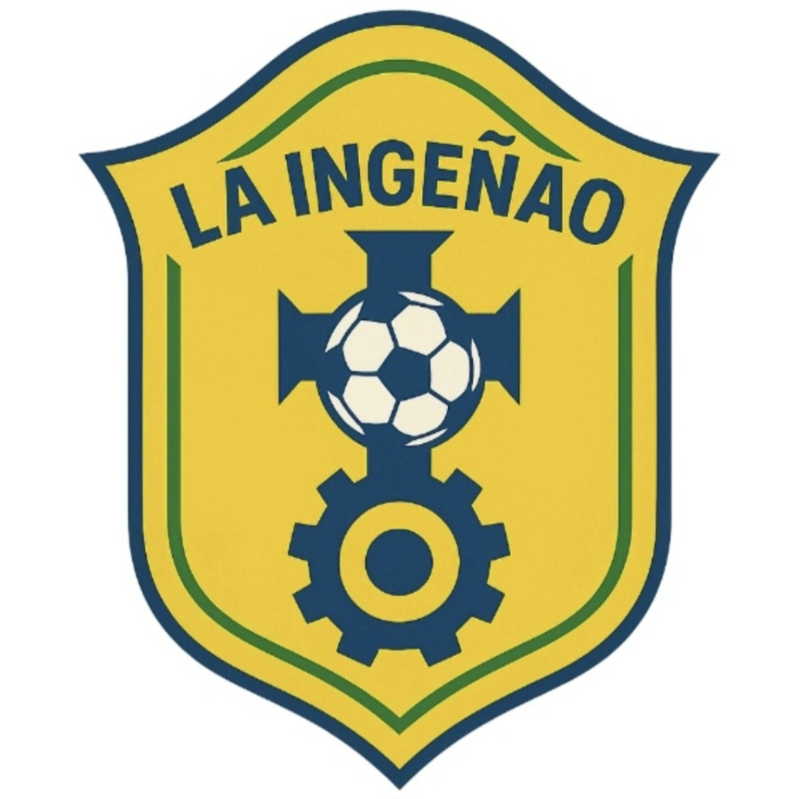
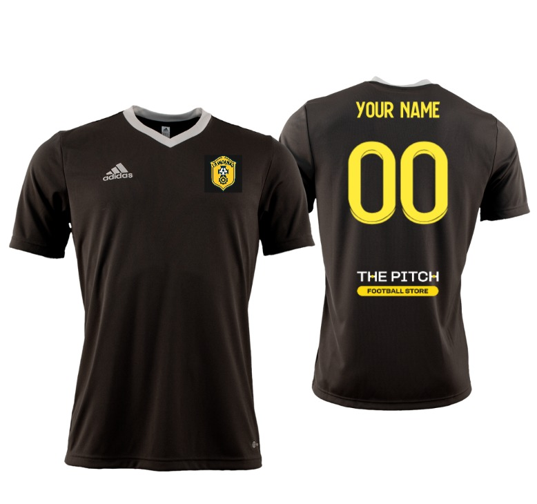

<html>
  <header>
<h1>La Ingeñao</h1>
</header>
<body>
<main>

Benvenuti nel mondo della Ingeñao, squadra di calcio a 7 formata da studenti del dipartimento di ingegneria e architettura dell'università degli studi di Trieste. Nata tra i corridoi di Ingegneria e cresciuta guardando i grandi brasiliani dominare il mondo del calcio. Perché sì, noi giochiamo come loro: con il sorriso, con fantasia, e con quella leggerezza che fa sembrare ogni passaggio una danza.

Ci ispiriamo ai grandi come Kaká, Romário, Ronaldo, Neymar e cerchiamo di portare un po’ del loro spirito anche tra un esame e l’altro.

Lo scorso maggio abbiamo partecipato al torneo organizzato da SIM, un’esperienza che ci ha fatto crescere come squadra e ci ha dato ancora più fame di vittoria.

<a href="risultati.html">Scopri i risultati</a>

E non ci fermiamo qui: abbiamo in programma molti altri tornei, partite e avventure, perché per noi il calcio è più di un gioco — è un modo di vivere l’università con passione, amicizia e un pizzico di follia ingegneristica.

<a href="palmarès.html">Scopri il nostro plmarès</a>

Lasciamo il nostro <a href="https://www.instagram.com/laingenao/">Instagram</a> su cui puntiamo molto. Contiamo 42 follower e speriamo in futuro crescano.

<h1>FORZA INGEÑAO</h1>

</main>
</body>
</html>
